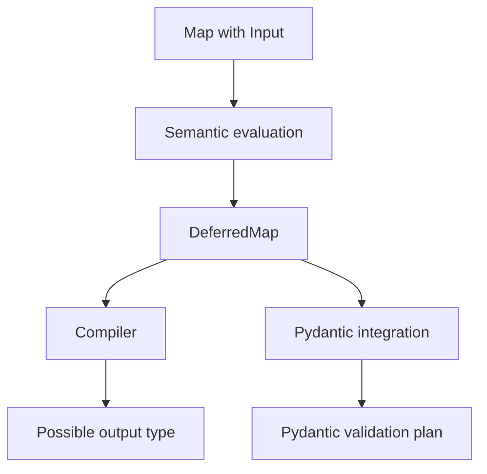
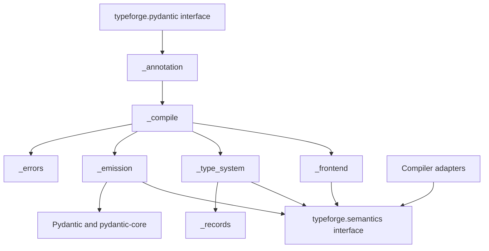

# Pydantic Integration Redesign

Status: Idea  
Scope: Shared `Map` semantics and the Pydantic v2 integration

## Decision

Replace the private Pydantic implementation while preserving the public
`Schema` and `Input` interface.

Before that replacement, deepen `typeforge.semantics` so it consumes behavior
that is currently duplicated in the compiler and Pydantic modules:

- structural `Case` pattern matching;
- `Value` capture and substitution;
- representation of a `Map` that must wait for `Input`;
- calculation of that deferred `Map`'s possible output type.

Semantics owns the meaning of Typeforge expressions. It does not own compiler
emission, Pydantic validation, Python typing reflection, or Pydantic core
schemas.

Use the existing implementations and tests as a behavioral oracle. Do not build
the replacement on top of the old Pydantic evaluator, and do not leave both
semantic paths after migration.

## Why this change is needed

The semantics module is too shallow for its intended responsibility. It can
evaluate conditions, atomic `Map` subjects, unions, and record transformations.
It cannot represent all structural `Map` behavior or a `Map` whose subject is
`Input`.

That missing behavior has leaked into both consumers.

### Compiler implementation

The compiler already represents structural types with
`compiler.lowering.TypeApplication`. It represents `Value` with `MapValueType`.
`compiler._pipeline_adaptation` performs recursive pattern matching, captures a
matched type, and substitutes the capture into the selected output.

### Pydantic implementation

The Pydantic integration independently defines `ApplicationExpression` and
`ValueExpression`. It has a second recursive pattern matcher and stores deferred
`Input` behavior in `RuntimeMapPlan`.

### Shared semantics

The shared model has no structural type pattern. Compiler semantic lowering
currently reduces most applied types to an opaque `NamedType` string, so the
shared evaluator cannot see the constructor, arguments, or `Value` capture.

This is one Typeforge meaning with two implementations:

```text
compiler TypeApplication + MapValueType ─┐
                                         ├─ structural Map behavior
Pydantic ApplicationExpression + Value  ─┘
```

The migration moves that behavior into shared semantics. The compiler and
runtime frontends then adapt their representations to the same semantic data.

## Responsibility map

| Responsibility | Owner |
|---|---|
| Parse authored Python source | Compiler frontend |
| Preserve source spans and authored diagnostics | Compiler |
| Adapt Python typing objects and aliases | Runtime frontend |
| Define ordered `Map` and `Case` behavior | Semantics |
| Match structural type patterns | Semantics |
| Bind and substitute `Value` | Semantics |
| Represent a `Map` waiting for `Input` | Semantics |
| Calculate a deferred `Map`'s possible output type | Semantics |
| Inspect and construct backend type values | `TypeSystem` adapter |
| Emit standard Python typing constructs | Compiler |
| Observe raw validation input | Pydantic integration |
| Choose and build a Pydantic validation plan | Pydantic integration |
| Emit `CoreSchema`, serialization, and JSON Schema | Pydantic integration |

A responsibility belongs in semantics when it defines what a Typeforge
expression means and must agree across consumers. A responsibility remains in
an adapter when it depends on source syntax, Python runtime objects, or a target
library.

## Structural `Case` patterns

### `Value` is a contextual type reference

Inside `MapFields`, `Value` refers to the current field type.

Inside a structural `Case`, `Value` is a capture variable. It binds to the part
of the `Map` subject matched at that position.

For example:

```python
type UnwrapList[T] = Map[
    T,
    Case[list[Value], Value],
    Default[T],
]
```

The authored alias does not know `T`. When `UnwrapList[list[int]]` is evaluated:

1. `T` resolves to `list[int]`.
2. The pattern `list[Value]` matches the subject `list[int]`.
3. `Value` captures `int`.
4. The output `Value` resolves to `int`.

For `UnwrapList[bytes]`, the structural pattern does not match and the default
returns `bytes`.

`Value` is not a Python `TypeVar`. A generic parameter such as `T` is bound when
a generic alias is applied. A structural `Value` is bound later, while semantic
evaluation matches a `Case`.

### Model parameterized type roles explicitly

Do not promote Pydantic's `ApplicationExpression` into shared semantics. Its
name uses the type-theory term "application" for a parameterized type and hides
two different roles:

- a parameterized type in a `Case` test is a pattern;
- a parameterized type in a selected output is a type template awaiting `Value`
  substitution.

Represent the pattern role directly. A possible initial model is:

```python
@dataclass(frozen=True, slots=True)
class ExactTypePattern[T]:
    value: T


@dataclass(frozen=True, slots=True)
class CaptureValuePattern:
    pass


@dataclass(frozen=True, slots=True)
class ParameterizedTypePattern[T]:
    origin: T
    arguments: tuple[TypePattern[T], ...]


type TypePattern[T] = (
    ExactTypePattern[T]
    | CaptureValuePattern
    | ParameterizedTypePattern[T]
)
```

A `Case` test is either a condition or a type pattern. Shared evaluation owns
first-match ordering and recursive pattern matching.

The pattern model must preserve these rules:

- constructors must match;
- argument counts must match;
- nested arguments are matched recursively;
- `Value` captures the matched type;
- repeated `Value` occurrences refer to the same capture and must match the same
  type;
- a failed pattern does not change the evaluation context.

### Structural outputs

Captured types can appear inside a selected output:

```python
type ListToSet[T] = Map[
    T,
    Case[list[Value], set[Value]],
    Default[T],
]
```

This needs a type template that can be materialized after `Value` is bound. Keep
that role separate from `ParameterizedTypePattern`.

A minimal template model needs:

- a concrete backend type reference;
- a reference to the captured `Value`;
- a parameterized type with nested template arguments.

Do not turn semantics into a complete Python typing syntax tree. Support the
structural forms required by Typeforge relationships. Treat other backend types
as opaque references until Typeforge gives their structure shared meaning.

### `TypeSystem` seam

Shared semantics must not know how the compiler or Python runtime represents
`list[int]`. A `TypeSystem` adapter supplies small operations over the backend's
type values.

Use explicit names such as:

```python
@dataclass(frozen=True, slots=True)
class ParameterizedTypeShape[T]:
    origin: T
    arguments: tuple[T, ...]


class TypeSystem[T](Protocol):
    def inspect(
        self,
        value: T,
    ) -> Result[ParameterizedTypeShape[T] | None, SemanticIssue]: ...

    def build(
        self,
        shape: ParameterizedTypeShape[T],
    ) -> Result[T, SemanticIssue]: ...
```

These methods inspect and build parameterized types. They are primitive backend
type operations and can be implemented without knowledge of `Map`, `Case`,
`Value`, captures, or Pydantic.

Shared semantics owns matching and substitution. The adapters own only backend
representation:

- the compiler adapter inspects and constructs compiler-owned type data;
- the runtime adapter uses Python typing operations such as `get_origin`,
  `get_args`, and subscription.

A method that accepts a complete Typeforge pattern or performs capture would
leak semantic behavior into `TypeSystem` and recreate the duplication this
change removes.

## Deferred `Input` maps

### `Input` delays case selection

Consider:

```python
type Identifier = Map[
    Input,
    Case[int, int],
    Case[str, UUID],
]
```

During schema construction there is no input value, so semantic evaluation
cannot select a `Case`. This is not an invalid expression. It is a valid `Map`
whose selection must wait for `Input`.

Semantics must preserve the unresolved meaning instead of returning an unbound
`Input` error or reducing the expression to a union.

Call this semantic result a `DeferredMap`, not a validation plan.

A `DeferredMap` preserves:

- authored case order;
- each case test and its corresponding output;
- the optional default;
- the evaluation context required by nested expressions;
- the possible output type;
- the rule that no default produces a no-match failure.

It contains no Pydantic execution details.

### Possible output type

For:

```python
Map[
    Input,
    Case[int, int],
    Case[str, UUID],
    Default[bytes],
]
```

the possible output type is:

```python
int | UUID | bytes
```

This is a semantic fact about the `Map`, not a compiler rendering decision.
Semantics calculates it from reachable case outputs and the default. The
compiler renders that result as standard Python typing syntax.

Calculating it in semantics keeps consumers consistent. If the compiler and
Pydantic integration calculate it independently, they can disagree about
reachable outputs, `Never`, duplicate members, or defaults.

The no-match path is a failure and does not add an output type.

### From deferred meaning to validation

Pydantic consumes the `DeferredMap` and creates a private Pydantic validation
plan. That plan can use a tagged union, callable discriminator, validator, or
another Pydantic mechanism.



Semantics does not own:

- raw Python input values;
- `CoreSchema`;
- Pydantic validators or serializers;
- dispatch tags;
- callable discriminators;
- JSON Schema;
- the choice of Pydantic execution strategy.

Before implementation, define the supported value-time pattern language.
Current documented behavior includes ordered, strict matching on the raw input
type. Additional behavior in the old implementation is not automatically part
of the semantic contract. Unsupported patterns must fail explicitly.

## Pydantic module design

The public interface remains:

```python
from typeforge.pydantic import Input, Schema
```

No parser, evaluator, deferred result, record adapter, error type, validation
plan, or core-schema constructor becomes public.

A suitable private topology is:

```text
src/typeforge/pydantic/
    __init__.py
    _annotation.py
    _compile.py
    _frontend.py
    _type_system.py
    _records.py
    _emission.py
    _errors.py
```

Create files for cohesive responsibilities, not to mirror every domain noun.
Add a separate planning module only when strategy selection becomes a substantial
responsibility.

### Annotation and orchestration

`_annotation.py` owns `Schema`, `Input`, and the Pydantic schema metadata hook.
The hook delegates immediately to one private orchestration function.

`_compile.py` owns this pipeline:

```text
Python typing object
    -> runtime frontend
    -> shared semantic expression
    -> shared semantic evaluation
    -> resolved semantic value or DeferredMap
    -> Pydantic emission
    -> CoreSchema
```

It contains no expression-specific rules and no core-schema construction.

### Runtime frontend

`_frontend.py` adapts Python typing objects into shared semantic data. It owns:

- marker recognition by identity;
- marker arity validation;
- PEP 695 alias expansion;
- generic parameter and `TypeVarTuple` substitution;
- `Unpack`, union, literal, and `Annotated` handling;
- adaptation of structural `Case` tests into shared type patterns;
- cycle detection;
- preservation of ordinary opaque types and metadata.

It performs no case selection and constructs no Pydantic schema.

### Runtime type system and records

`_type_system.py` implements `TypeSystem[object]` for Python typing objects. It
owns equality, assignability, unions, inspection and construction of
parameterized types, and delegation to explicit record adapters.

`_records.py` initially supports only `TypedDict` and returns a family-aware
`RecordShape`.

Add a `BaseModel` record adapter only after Typeforge defines its construction,
validation, serialization, alias, default, configuration, private attribute,
computed field, and output identity semantics. It must not reuse `TypedDict`
semantics.

### Pydantic emission

`_emission.py` converts resolved semantic values and `DeferredMap` data to
Pydantic core schemas.

For ordinary resolved types, delegate to
`GetCoreSchemaHandler.generate_schema`. Construct schemas directly only for
Typeforge-synthesized shapes and deferred behavior.

For the first replacement, preserve the current observable `Input` behavior:

1. inspect raw input before branch validation;
2. select the first matching authored case;
3. validate with the selected output schema;
4. keep private dispatch data out of returned values;
5. serialize with the selected output behavior;
6. report an unmatched input with the stable `typeforge_map_no_match` code.

The Pydantic execution strategy remains private and replaceable.

### Errors

`_errors.py` owns stable Pydantic-facing diagnostics and maps modeled frontend,
semantic, planning, and emission failures.

Convert expected construction failures to `PydanticSchemaGenerationError` once
at the metadata hook. Let unexpected exceptions propagate. Convert per-value
no-match to a Pydantic validation error at the validation seam.

## Dependency direction



Required directions:

- semantics depends on neither compiler nor Pydantic implementation;
- compiler and Pydantic import semantics through `typeforge.semantics`;
- compiler and Pydantic implementation do not depend on each other;
- runtime frontend does not depend on Pydantic emission;
- core-schema construction stays in the Pydantic module;
- importing base `typeforge` does not import Pydantic;
- dependencies remain acyclic.

Pydantic is an external package but an in-process dependency. Integration tests
use actual Pydantic. Do not add a broad mock core-schema protocol.

## Behavior contract

Preserve these tested behaviors through the replacement:

- `Schema[T]` returns the resolved value, not a wrapper;
- ordinary types and metadata are delegated to Pydantic;
- schema-time evaluation adds no Typeforge call to individual validations;
- structural patterns capture and substitute `Value`;
- `Input` dispatch is ordered, strict, and occurs before branch coercion;
- an omitted `Input` default produces a validation failure;
- `MapFields` supports `TypedDict` explicitly and preserves transformed field
  behavior;
- ordinary recursive aliases are delegated to Pydantic;
- recursive aliases containing Typeforge operators fail explicitly until that
  capability is designed;
- definitions and references are deterministic;
- stable diagnostic codes and authored vocabulary are preserved.

Treat `{}` JSON Schema for deferred dispatch as a temporary honest result, not a
permanent compatibility promise. Test deterministic definition reuse and
collision avoidance without depending on unrelated core-schema layout.

## Migration sequence

### 1. Deepen structural semantics

- Add explicit structural type patterns and `Value` capture.
- Add the minimum output-template data needed for captured structural outputs.
- Extend `TypeSystem` so adapters can inspect and build parameterized types.
- Move recursive matching and substitution into shared evaluation.
- Add tests for nested patterns, repeated captures, failed captures, structural
  outputs, and adapter failure propagation.

Completion criterion: compiler-like and runtime-like adapters produce the same
semantic result for every supported structural pattern case.

### 2. Add deferred `Map` semantics

- Return `DeferredMap` when a valid `Map` needs `Input` for case selection.
- Calculate its possible output type in semantics.
- Preserve case order, default behavior, and no-match behavior.
- Define and test the supported value-time pattern language.

Completion criterion: semantics can distinguish an invalid unbound `Input` from
a valid deferred `Map`, and both consumers receive the same possible output
type.

### 3. Complete the compiler cutover

- Preserve parameterized type structure during compiler semantic lowering.
- Adapt compiler parameterized types to shared patterns and templates.
- Consume `DeferredMap.possible_output` for static output.
- Remove the compiler's private structural matcher and capture substitution after
  all call sites use shared semantics.

Completion criterion: compiler structural and `Input` behavior passes through
`typeforge.semantics`, with no second matcher remaining in the compiler.

### 4. Build the replacement Pydantic pipeline

- Adapt Python typing objects directly to shared semantic data.
- Implement the runtime `TypeSystem` and `TypedDict` record adapter.
- Emit resolved values and `DeferredMap` through Pydantic.
- Preserve validation, serialization, JSON Schema, definitions, and diagnostics.

Completion criterion: all Pydantic behavior tests pass without calling the old
runtime expression model or evaluator.

### 5. Cut over and delete the duplicate path

- Point the schema metadata hook at the replacement orchestration function.
- Delete the old Pydantic expression model, evaluator, matcher, and emission
  pipeline.
- Delete old unit tests that test past the new interface; retain behavior tests
  at `Schema` and semantics tests at the semantics interface.

Completion criterion: one semantic implementation serves compiler and Pydantic,
and the final diff contains no compatibility bridge to the old evaluator.

### 6. Add architecture protection

Extend the architecture source model and enforce:

1. Pydantic imports semantics only through its supported interface.
2. Semantics and compiler do not depend on Pydantic.
3. Pydantic does not depend on compiler implementation.
4. Runtime frontend does not depend on core-schema emission.
5. Core-schema construction is confined to Pydantic-owned implementation.
6. Modules outside `typeforge.pydantic` do not import its private files.
7. The Pydantic dependency graph has no cycles.

Completion criterion: focused architecture tests fail for each forbidden sample
dependency and pass for the intended topology.

## Deferred decisions

This migration does not require decisions about:

- recursive Typeforge aliases;
- a public record-adapter registry;
- a public explanation interface;
- configurable Pydantic execution strategies;
- a shared runtime package for integrations other than Pydantic;
- complete JSON Schema for raw `Input` dispatch;
- ambiguous serialization across overlapping output branches.

The seams above keep these choices local when their requirements are known.
